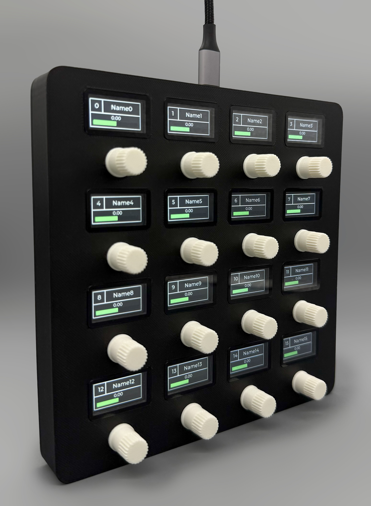
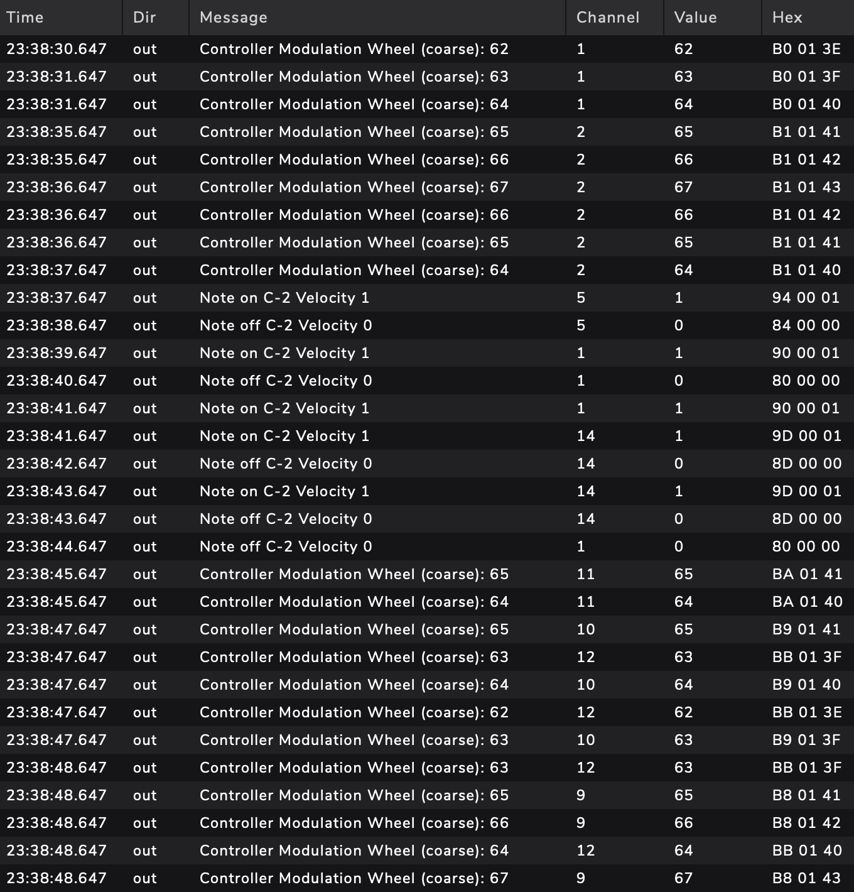
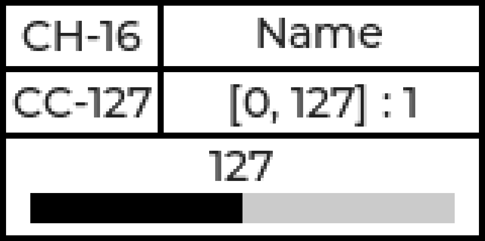
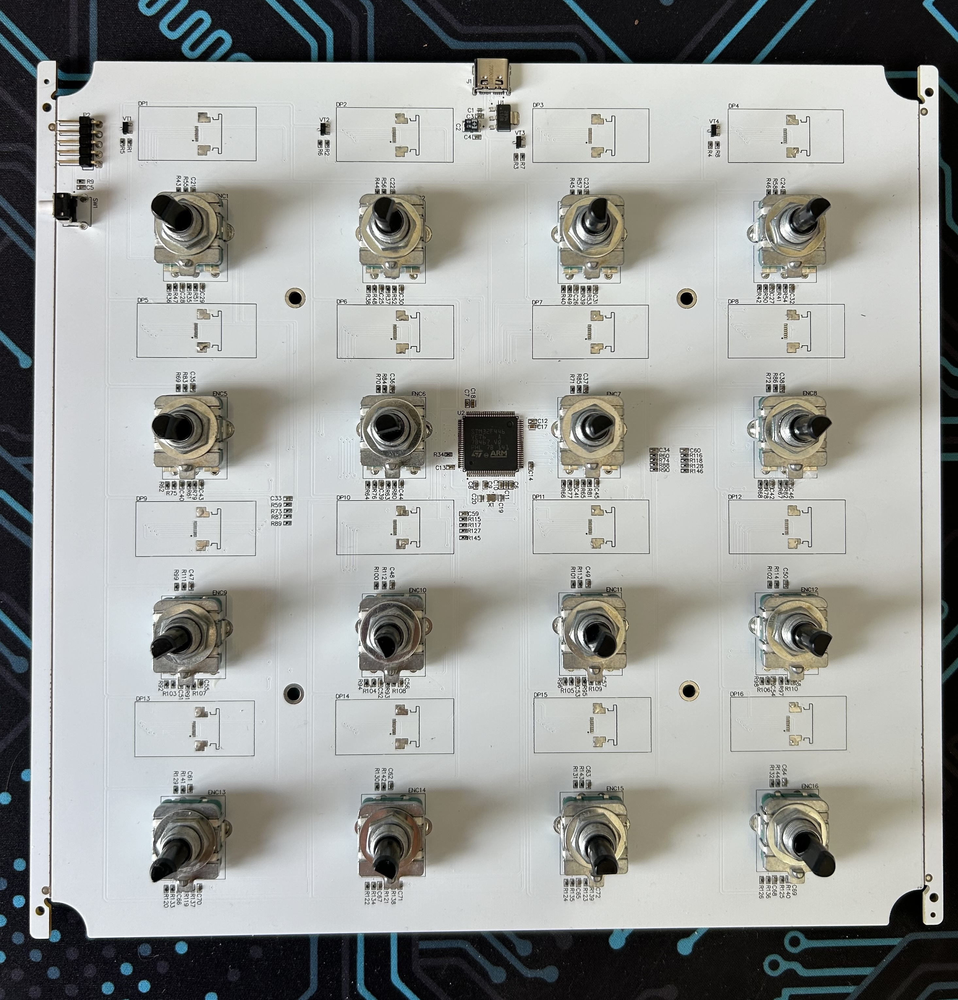
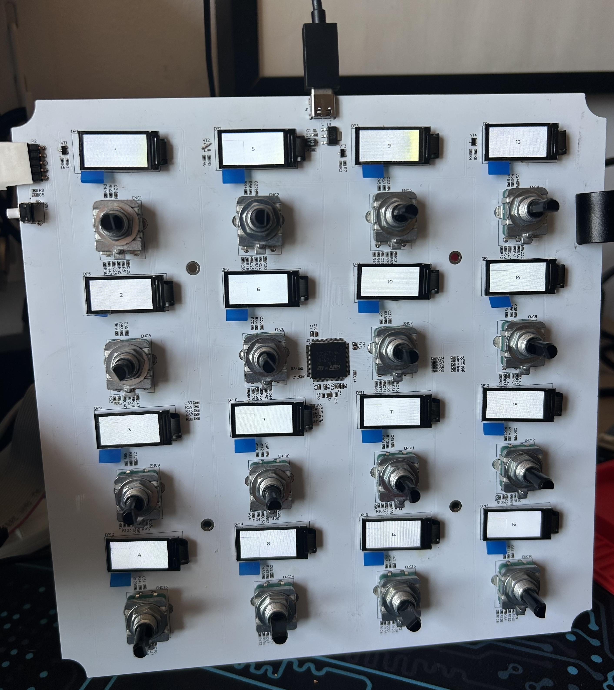
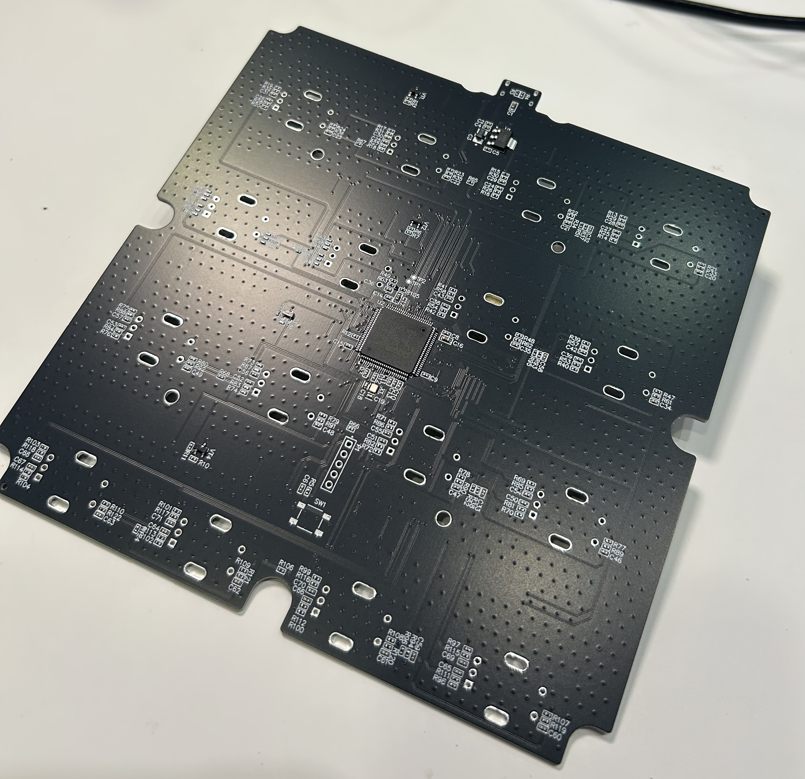
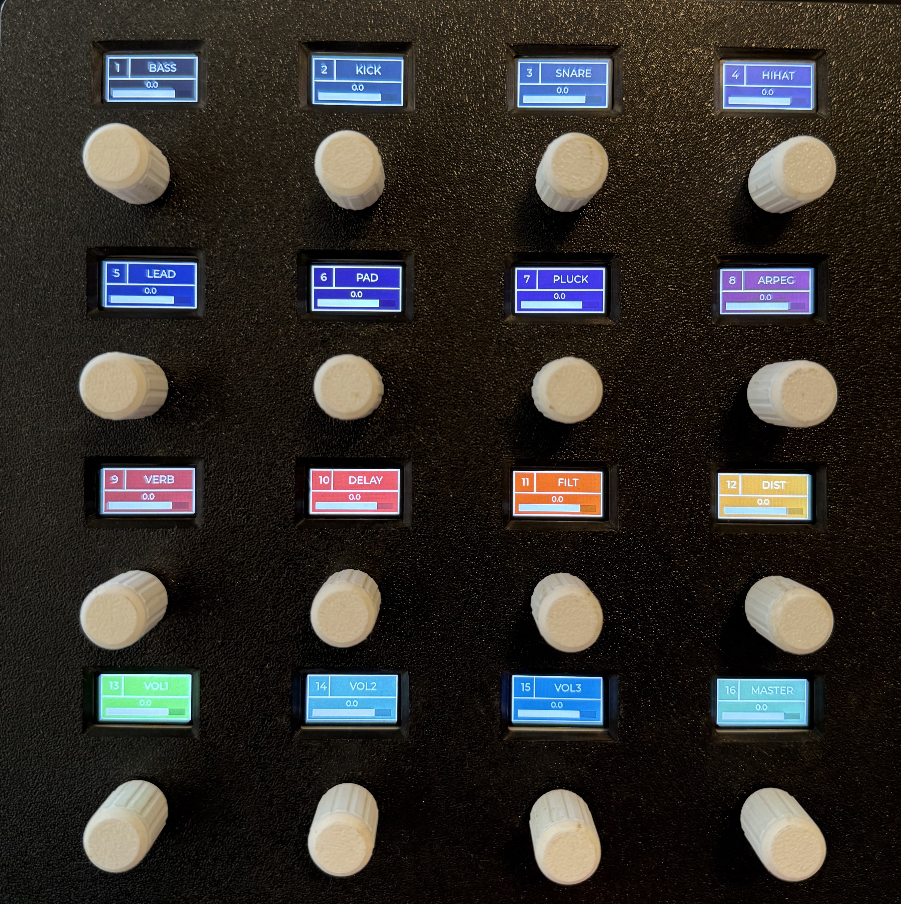
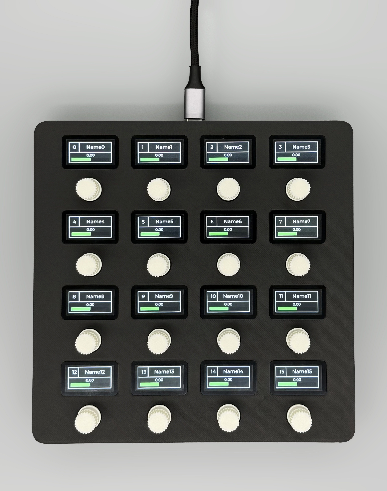
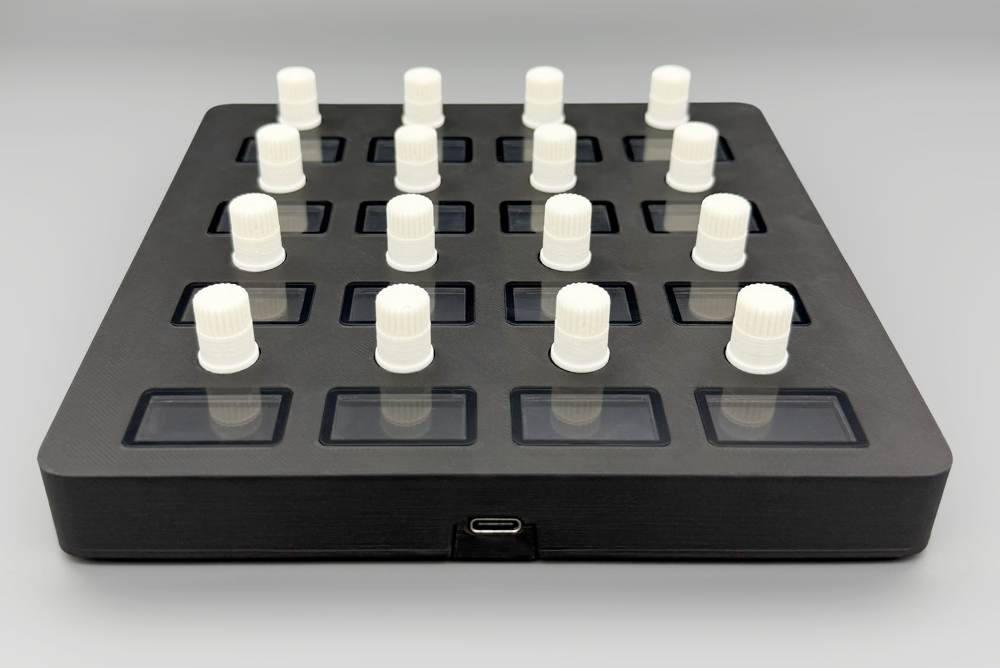

### Hexadeck

This repository contains hexadeck project sources.



#### Hardware Features

- MCU - STM32F446VET6
- 16x Encoders - Bourns PEC12R, 24 quadrature 
- 16x Displays - TFT LCD, 160x80px
- USB-C for power and data

#### Firmware Features

- FreeRTOS
- LVGL
- Composite USB interface - MIDI & Serial classes
- Configurable MIDI outputs for encoders & push-buttons (channels, cc)
- Configurable UI screen elements
- Configuration through MIDI input & Serial interfaces

#### MIDI Output Interface

On every encoder event device sends MIDI commands to the connected USB host. Easy way to check MIDI commands on host PC is to use MidiView app.
<details>
<summary>MidiView monitor screenshot</summary>

</details>

##### Default MIDI configuration

- Channel: 1
- Encoders
  - CC0..CC15
  - Values: 0..127
- Push-buttons
  - CC102..CC117
  - Values: 0/127

#### Device Configuration

##### Serial Interface

Device supports a set of commands to setup interface fields through serial port. Each command is an ASCII-string with '\n' terminator. 

| Command            | Description                                  | Parameters                                                   |
| ------------------ | -------------------------------------------- | ------------------------------------------------------------ |
| `/set/value/x/y`   | Set current MIDI value                       | *x* - display id<br />*y* - value                            |
| `/set/channel/x/y` | Set MIDI channel                             | *x* - display id<br />*y* - channel                          |
| `/set/cc/x/y`      | Set MIDI CC                                  | *x* - display id<br />*y* - cc                               |
| `/set/name/x/y`    | Set channel name on display                  | *x* - display id<br />*y* - name                             |
| `/set/range/x/y`   | Set maximum range limit for MIDI values      | *x* - display id<br />*y* - range limit [1..127]             |
| `/set/step/x/y`    | Set  value step for one encoder incremention | *x* - display id<br />*y* - step [1..127]                    |
| `/set/color/x/y/z` | Set display interface element color          | *x* - display id<br />*y* - color element: "bg", "text", "border", "bar"<br />*z* - RGB color in hex, e.g. - "ff0000" - red, "ffffff" - white, etc. |
| `/fw/update`       | Put device into DFU mode for update          |                                                              |

#### Display Elements

Each display interface consists of channel, cc, name, range, stevalue and bar elements.



#### PCB

<details>
<summary>Rev-A</summary>
 
</details>
<details>
<summary>Rev-B</summary>

</details>

#### Assembled Device

<details>
<summary>Rev-A</summary>

</details>
<details>
<summary>Rev-B</summary>


</details>

#### Demo [Rev-A]

https://github.com/user-attachments/assets/066187ef-49a9-449c-b158-acdf62c2ad6f

#### Firmware update

Device can be update through DFU mode. To put device into DFU mode use MIDI Sysex or Serial commands from host PC or hold 4 corner push-buttons for 5 seconds. Place the firmware into the `./scripts/firmware_updater/binaries/` folder.

##### MacOS/Linux

```bash
./scripts/firmware_updater/update.sh -D hexadeck_fw_v0.bin
```

##### Windows

```bash
./scripts/firmware_updater/update.bat -D hexadeck_fw_v0.bin
```

#### TODO

- Steps parameter handling
- Configuration saving & loading on device, several banks
- Readme
  - Supported MIDI commands description
  - SysEx configuration
- Migrate project to Makefile build system
